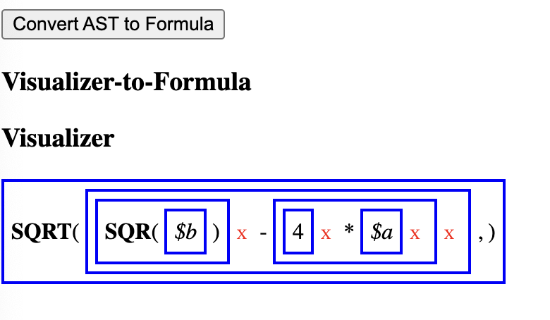
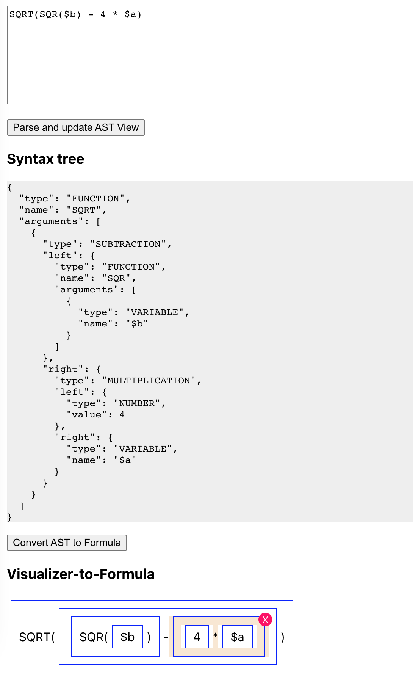
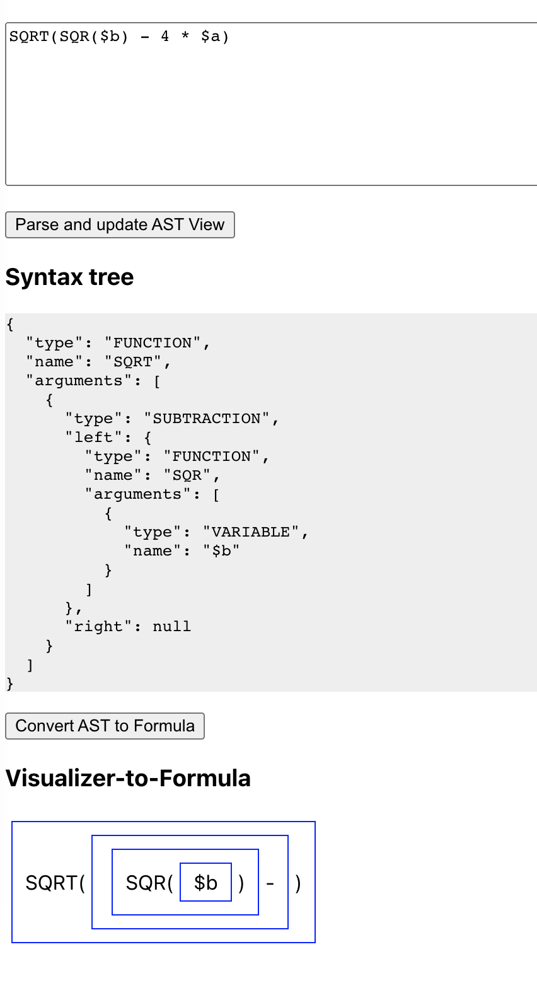

# ReadMe

Welcome to the solution of Catherine's programming challenge. In this project, I build a calculator with main features including:

1. Generate a formula string from the tree. (JSON syntax tree => Formula)

2. Design the architecture and component structure to visualize the formula hierarchy. 

3. Visualize a syntax tree (parsed JSON tree) in a UI component that represents the formula. (JSON syntax tree => Visualized Syntax Tree)

4. Allow deletion of nodes from the tree through UI interactions (Changes to UI -> changes to JSON syntax tree)



I use the example provided to build the component. 

How to test:

1. Click the "Parse and update AST View" button to show the Syntax tree.



2. Click the "Convert AST to Formula" button to show the visualized formula.



3. Click on the "canRemoveModule"(only some of sub-parts are removable), which are children of "+/-/*//", to delete some part of formula, and update the Syntax tree at same time. 

# Celonis Programming Challenge

Dear applicant,

Congratulations, you made it to the Celonis Programming Challenge!

Why do we ask you to complete this challenge?

First of all, we want to ask questions that are closer to the eventual job you’ll need to do. We also want to respect your time and schedule fewer in-person interviews. Finally, we’ll also share some insights into what we look at and how we evaluate. This challenge gives you the ability to shine :)

# Your task: designing and building a calculator

The task in this challenge is to build the formula visualization for a scientific calculator. The calculator should be able to take input in the form of a free text formula and then visualize & modify the formula.

You should limit yourself to 3 hours for this challenge, including familiarizing yourself with the challenge. As engineers we understand there is always more you want to do, but please respect the time limit for yourself. We understand this limit means your solution may not be comprehensive - that’s okay - but the solution should build and run so we can see the result of your work.

Note that there is nothing wrong with searching when you have certain questions or are unsure about some APIs, but you should avoid outright copying code. If you decide to copy code, please mark it as copied citing the source.

In the follow-up interview, expect to walk us through your design, code and discuss your approach to the challenge. What we are looking for:

- Analytical / problem-understanding / problem-solving skills
- Clear articulation of key design and coding decisions
- Ability to execute / implement
- OOP / abstraction / composition skills

# Technical details

## Description of the calculator language

The language which we want to execute is fairly simple and is similar to Excel syntax.

The language is built using the following rules (note that these are not formally correct, rather, an illustration):

```
EXPR = BINARY_EXPR 
    | FUNCTION 
    | UNARY_EXPR 
    | NUMBER 
    | STRING 
    | PARAMETER
    | PI
    | "(" EXPR ")"

BINARY_EXPR = EXPR + EXPR 
    | EXPR - EXPR 
    | EXPR * EXPR
    | EXPR / EXPR

FUNCTION = <FunctionName>"(" (EXPR (EXPR)*)? ")"

UNARY_EXPR = "-" EXPR

NUMBER = [Float or Integer Number]

STRING = "'"[String]"'"

PARAMETER = "$"[PARAMETER_NAME]

PI = "PI"
```

The following examples are valid queries

```
PI * SQR($r)

($b + SQRT (SQR($b) - 4 * $a)) / (2 * $a)
```


## Visualizing the formula

Data visualization is one of the key aspects of Celonis' software. In this task you should implement an interactive visualization of the formula entered.

As a starting point, in the src/ folder you can find a parser as well as AST classes and a small function library implemented for demonstration purposes. The output of the parser is a JSON syntax tree which is used below for the tasks.

# Tasks

Complete the following tasks for the challenge:

1. Generate a formula string from the tree. (JSON syntax tree => Formula)
2. Design the architecture and component structure you’ll use to visualize the formula hierarchy. Note that deleting nodes is non-trivial and should be included in your design (see example below).
3. Visualize a syntax tree (parsed JSON tree) in a UI component that represents the formula. It should be easy for the user to distinguish between functions, constants etc. (JSON syntax tree => Visualized Syntax Tree)
4. Allow deletion of nodes from the tree through UI interactions (Changes to UI -> changes to JSON syntax tree)

# Examples

Here’s one of our engineers’ example work to show you how the output of task 3 and 4 might look:


As another example, someone has entered the following formula for calculating the area of a circle: `PI * SQR(4)`. Here’s how the user could remove the ‘SQR(4)’ block from the formula (click to select, x button to remove):


This example is actually from Celonis’s formula editor UI, so it’s very polished compared to what we are asking for here, but it’s also representative of the work we do.

# Getting Started with Create React App

This project was bootstrapped with [Create React App](https://github.com/facebook/create-react-app).

## Available Scripts

In the project directory, you can run:

### `npm start`

Runs the app in the development mode.\
Open [http://localhost:3000](http://localhost:3000) to view it in your browser.

The page will reload when you make changes.\
You may also see any lint errors in the console.

### `npm test`

Launches the test runner in the interactive watch mode.\
See the section about [running tests](https://facebook.github.io/create-react-app/docs/running-tests) for more information.

### `npm run build`

Builds the app for production to the `build` folder.\
It correctly bundles React in production mode and optimizes the build for the best performance.

The build is minified and the filenames include the hashes.\
Your app is ready to be deployed!

See the section about [deployment](https://facebook.github.io/create-react-app/docs/deployment) for more information.

### `npm run eject`

**Note: this is a one-way operation. Once you `eject`, you can't go back!**

If you aren't satisfied with the build tool and configuration choices, you can `eject` at any time. This command will remove the single build dependency from your project.

Instead, it will copy all the configuration files and the transitive dependencies (webpack, Babel, ESLint, etc) right into your project so you have full control over them. All of the commands except `eject` will still work, but they will point to the copied scripts so you can tweak them. At this point you're on your own.

You don't have to ever use `eject`. The curated feature set is suitable for small and middle deployments, and you shouldn't feel obligated to use this feature. However we understand that this tool wouldn't be useful if you couldn't customize it when you are ready for it.

## Learn More

You can learn more in the [Create React App documentation](https://facebook.github.io/create-react-app/docs/getting-started).

To learn React, check out the [React documentation](https://reactjs.org/).

### Code Splitting

This section has moved here: [https://facebook.github.io/create-react-app/docs/code-splitting](https://facebook.github.io/create-react-app/docs/code-splitting)

### Analyzing the Bundle Size

This section has moved here: [https://facebook.github.io/create-react-app/docs/analyzing-the-bundle-size](https://facebook.github.io/create-react-app/docs/analyzing-the-bundle-size)

### Making a Progressive Web App

This section has moved here: [https://facebook.github.io/create-react-app/docs/making-a-progressive-web-app](https://facebook.github.io/create-react-app/docs/making-a-progressive-web-app)

### Advanced Configuration

This section has moved here: [https://facebook.github.io/create-react-app/docs/advanced-configuration](https://facebook.github.io/create-react-app/docs/advanced-configuration)

### Deployment

This section has moved here: [https://facebook.github.io/create-react-app/docs/deployment](https://facebook.github.io/create-react-app/docs/deployment)

### `npm run build` fails to minify

This section has moved here: [https://facebook.github.io/create-react-app/docs/troubleshooting#npm-run-build-fails-to-minify](https://facebook.github.io/create-react-app/docs/troubleshooting#npm-run-build-fails-to-minify)
